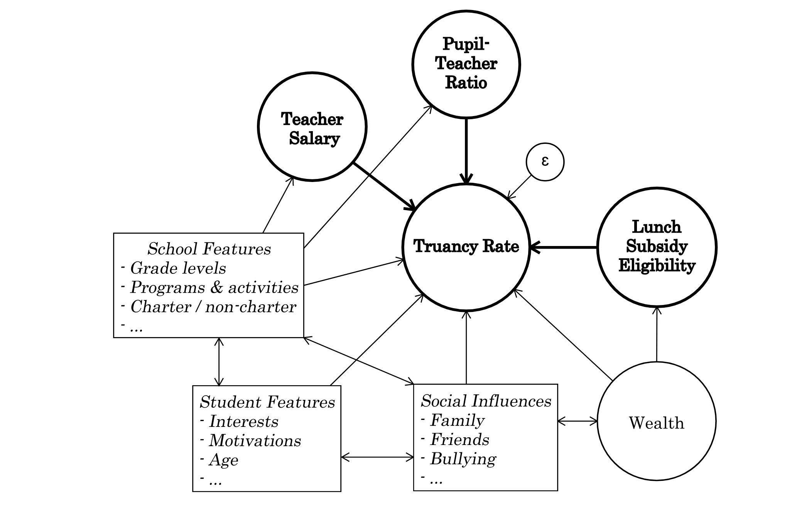

```{r set defaults, echo=FALSE}
knitr::opts_chunk$set(echo=FALSE, message=FALSE, warning=FALSE) 
knitr::knit_hooks$set(inline=function(x) {prettyNum(x, big.mark=",")})
```

```{r libraries}
library(knitr)
library(lmtest)
library(patchwork)
library(sandwich)
library(stargazer)
library(tidyverse)
# install.packages("ggcorrplot")
library(ggcorrplot)

theme_set(theme_bw())
hist_color <- "white"
hist_fill <- "black"
hist_size <- .25
```

```{r load data}

## awesome_data.rds contains a structured list with useful objects
## including data frames

awesome_data <- read_rds("awesome_data.rds")
```

```{r establish data frames}

## We use our school district level dataset.  We reorder the 
## lunch_subsidy_eligibility factor for presentation purposes.

df.d <- awesome_data$consolidated.district
df.d$lunch_subsidy_eligibility <- factor(df.d$lunch_subsidy_eligibility, levels=c('LOW', 'AVG', 'HIGH'))
```  

```{r build regression models}

## School District models

model_1 <- lm (log(truancy_rate) ~ pupil_teacher_fte_ratio, data=df.d)
model_2 <- lm (log(truancy_rate) ~ pupil_teacher_fte_ratio + lunch_subsidy_eligibility, data=df.d)
model_3 <- lm (log(truancy_rate) ~ lunch_subsidy_eligibility + pupil_teacher_fte_ratio:lunch_subsidy_eligibility, data=df.d)
model_4 <- lm (log(truancy_rate) ~ lunch_subsidy_eligibility + pupil_teacher_fte_ratio:lunch_subsidy_eligibility + I(average_salary/1000), data=df.d)

model_1.se <- coeftest(model_1, vcov=vcovHC)[ , "Std. Error"]
model_2.se <- coeftest(model_2, vcov=vcovHC)[ , "Std. Error"]
model_3.se <- coeftest(model_3, vcov=vcovHC)[ , "Std. Error"]               
model_4.se <- coeftest(model_4, vcov=vcovHC)[ , "Std. Error"]       
```

\newpage

# Introduction

## Motivation
"If you want to be cool, stay in school!" said the PSA from the Council for Basic Education. For decades generations of children have heard the message about the importance of staying in school. Absenteeism is defined as missed school attendance from both excused or unexcused (truant) absences. Chronic absenteeism is defined as missing 15 or more days within a given school year. According to a 2007 study published by [Allensworth and Easton](https://consortium.uchicago.edu/sites/default/files/2018-10/07%20What%20Matters%20Final.pdf), "course attendance is eight times more predictive of course failure in the freshman year than eighth-grade test scores." This is an astounding revelation and addressing the issue of absenteeism should, therefore, be a large motivating factor for all stakeholders in the education system -- from students, to parents, to teachers, and administrative staff -- to ensure their students' success. Additionally, chronic absenteeism may be an indicator of future antisocial behavior and has been linked to poor socio-economic and socio-emotional outcomes.

According to the [US Department of Education](https://www2.ed.gov/datastory/chronicabsenteeism.html), the slippery slope of chronic absenteeism begins in early childhood, between preschool to first grade. As described in the report by [Professor Donald J. Hernandez](https://assets.aecf.org/m/resourcedoc/AECF-DoubleJeopardy-2012-Full.pdf), children at this level who exhibit chronic absenteeism are less likely to read at grade level by the third grade translating to a four times likelihood of dropping out of high school. Students who exhibit chronic absenteeism are more likely to drop out of high school, which is linked to poor financial status, poor health, and involvement with the criminal justice system in adulthood. To put this issue into context, over 7 million students, roughly 1 in 6, were chronically absent from school in 2015-2016.

Absenteeism is a major problem of which truancy is our area of focus in this report.

## Research Question
In this report we study the research question:

> > > > *Do pupil-teacher ratios in public schools affect truancy rates?*

Our theory is that decreasing the number of students per teacher decreases the rate of unexcused absences (the truancy rate). We worked from data collected and published by the Colorado Department of Education (CDE) as required by the United States Safe and Drug-Free Schools and Communities Act. In order to avoid the influence of the COVID-19 pandemic, we looked only at the 2018-2019 school year.

Additionally, we examined other factors that may also influence truancy such as wealth and teacher salary.

While there is a possibility that a feedback loop between truancy and pupil-teacher ratio exists, we believe this to be of minor consequence because school funding and budgeting comes in fiscal year cycles and any meaningful changes to the pupil-teacher ratio during the school year will be limited.

The findings in this study will help public school administrators and educators make better-informed decisions about staffing levels within their districts to help decrease student truancy and increase their students' success.

\newpage

# Causal Model

```{r causal-model, fig.cap="Causal Model", out.width="75%", fig.align = 'center'}

```

Truancy is affected by many things. We believe the most important of these consist of:

* The student’s age, grade level, interests, abilities, and attitudes toward school (individual features)
* The influence of family, friends, and other students (social influences)
* Family and community wealth
* Features of the school including the size, breadth of programs offered (including both academic and extracurricular), whether the school is public or private, charter or non-charter, teacher salary, and pupil-teacher ratio (school features)
* The caliber of the teachers and their ability to focus on the individual student

The following discusses the groups of variables mentioned above. Each group includes a discussion of a few under that category but is non-exhaustive. We include them here because we suspect them to be the most relevant within the group.

_**Individual Features:**_

\begin{itemize}
  \item[] Clearly, whether a particular student is inclined to attend school depends to a large extent on the characteristics of that individual. Does the student care about learning and performing well in school? Does the student think that school is relevant? Someone who aspires to be the lead singer of Green Day (Billie Joe Armstong won’t last forever, rock on) may not care about geometry. 

  \item[] The student’s age likely matters. Younger students are likely less independent so their truancy is more of a function of their parent/guardian, while older students may be more drawn to particular extracurricular programs offered by the school. It’s difficult to know how age and grade level relate to truancy, but we suspect that they matter.
\end{itemize}

\newpage

_**Social Influences:**_

\begin{itemize}
  \item[] Students are influenced by the people in their lives. Friends and family matter a great deal. Parents and other family members set the tone while friends provide additional cultural norms. Do the parents or friends see value in school or not? What about older siblings who can be role models? What are the values of other significant members of the student’s family circle? What about the student’s friends? Is the student neglected or abused at home? If so, is school less relevant or perhaps a safe haven? Is the student the target of bullies at school? Each of these social influences plays a role.
\end{itemize}

_**Wealth:**_

\begin{itemize}
  \item[] School may be less relevant when the student’s family struggles to pay the rent or put food on the table. For some, attending school may be a luxury. For others, it is a second thought after finding, keeping, and maintaining a job to help their family with living expenses. On the other hand, the availability of subsidized meal programs and the relative security of a school environment may enhance a student’s propensity to attend school. Each of these factors plays a role in whether or not a student ultimately decides to go to school.
\end{itemize}

_**School Features:**_

\begin{itemize}
  \item[] Schools are not all the same. Not every school includes every grade level. Some schools teach the same material at different levels based on the academic abilities of the student population. Schools offer different extracurricular activities. A student might attend school because attendance is a prerequisite to playing on the basketball team. Is there a difference between public and private schools? Do charter schools experience different truancy rates?


  \item[] Some schools have better teachers than others whether due to factors such as compensation, individual teachers’ aptitude and motivation, or some other contributing factor. Additionally some schools put teachers in a better position to focus on the needs of individual students by virtue of lower pupil-teacher ratios.
\end{itemize}

# Research Design

We do not have all of the data necessary to perform a deductive test of our causal theory. We excluded both individual features and social influences from the study. We discuss the impact of these omissions in the Model Limitations section of this report.

We used eligibility for free and reduced lunch programs as a proxy for wealth. The National School Lunch Program (NSLP) is a federally assisted meal program operating in public and nonprofit private schools and residential child care institutions. It provides nutritionally balanced, low-cost, or no-cost lunches to children each school day. See [link](https://www.fns.usda.gov/nslp). Those with incomes between 130 and 185 percent of the Federal poverty level are eligible for reduced-price meals. Schools may not charge children more than 40 cents for a reduced-price lunch. See [link](https://www.fns.usda. gov/school-meals/income-eligibility-guidelines). In order to simplify the practical application of our study’s results, we binned lunch subsidy data into a three-level ordered factor variable.

We do not have data on the full range of school features or a measure of teacher caliber. We do have data on pupil-teacher ratios and average teacher salaries by school district. We rely on those variables.

Our causal model, as reflected in the graph appearing in Figure \@ref(fig:causal-model), incorporates the elements discussed above, including the use of lunch subsidy levels as a proxy for wealth, pupil-teacher ratio as a proxy for school features, and the use of teacher salary as a proxy for teacher caliber. Elements in the graph that are bold appear in our regression models.

# Data

## Unit of Observation

While we gathered data at both individual school and school district levels we concluded that our study would be based on school district level data. 

Looking at individual schools provides a more granular perspective and many more data points. It also permits us to explore the impact of whether a school is a charter school or not. However, not all schools offer the same mix of grades (even amongst a given level, such as middle schools) and we suspect that the impact of pupil-teacher ratios on truancy varies with student age (grade level). Thus, we did not want to draw conclusions solely from a review of school level data.

Additionally, we do not have access to grade level truancy by school or school district, or teacher salary information by school. As we explored the data we found that individual school data, without the ability to further partition by grades, was not helpful. To address potential data bias at the school level due to differing grade level mixtures, we opted to rely on analysis at the school district level. School districts have a mix of students at all grade levels. We did not explore the degree to which the distribution of students by grade is consistent across school districts but we believe it is reasonable to assume that the distribution of students by age across school districts would be more consistent than looking at individual schools. One consequence of working at the school district level is that we were unable to use information about individual school type (charter or non-charter schools) that we collected, which would likely have provided useful additional information.

When necessary we derive district level data by aggregating school level data.

## Dependent, Explanatory, and Background Variables

### Truancy Rate

The dependent variable in our research question is `truancy_rate`. In simplest terms, it is the ratio of the number of unexcused days absent to the total number of possible days attended. So, if there are $100$ students and $200$ days of school in a measurement period, the total number of possible days attended would be $20,000$. If there were $75$ unexcused absences during the period, the truancy rate would be $\frac{75}{20,000}$ or `r round(75/20000,5)`.

The CDE provides school level truancy data. We derive school district truancy data by aggregating school level data. For a detailed discussion of truancy rates in Colorado and related school attendance information see [link](https://www.cde.state.co.us/cdereval/truancystatistics). As we discuss below, Colorado schools self- report truancy information and do not have a consistent definition of unexcused absence. That calls into question the ability to compare truancy data across schools. We proceed with our study acknowledging that limitation.

The pair of plots below show that the distribution of `truancy_rate` is compressed on the left hand side of the x axis at values up to approximately $2.5\%$.  The right plot below shows the distribution of `log(truancy_rate)`.

```{r truancy plots, fig.height=2, fig.width=10, fig.align='center'}
plot_truancy_d <- df.d %>% 
  ggplot() +
  aes(x = truancy_rate) +
  geom_histogram(bins = 20, color = hist_color, fill = hist_fill, size = hist_size) +
  scale_x_continuous(labels = scales::percent) +
  xlab ("truancy rate")

plot_truancy_log_d <- df.d %>% 
  ggplot() +
  aes(x = log(truancy_rate)) +
  geom_histogram(bins = 20, color = hist_color, fill = hist_fill, size = hist_size) +
  xlab("log(truancy rate)")

plot_truancy_d + plot_truancy_log_d +
  plot_annotation(title = "Truancy Rate Distribution") &
  theme(plot.title = element_text(hjust = 0.5))
```

### Pupil-Teacher Ratio

The explanatory variable that is the focus of our analysis is `pupil_teacher_fte_ratio`.  It is the ratio of the number of students at a point in time divided by the full time equivalency of teaching assignments serving these students at that time.  The CDE measures pupil-teacher ratios on October 1 and provides school level data.  We derive school district truancy data from school level data.  See  [link](https://www.cde.state.co.us/cdereval/rvdefine).  

The plot below shows the distribution of `pupil_teacher_fte_ratio`.  We do not believe further transformation is warranted.

```{r pupil-teacher ratio plots, fig.height=2, fig.width=5, fig.align='center'}
plot_pt_ratio_d <- df.d %>% 
  ggplot() +
  aes(x = pupil_teacher_fte_ratio) +
  geom_histogram(bins = 20, color = hist_color, fill = hist_fill, size = hist_size) +
  scale_x_continuous(labels = scales::comma_format()) +
  xlab ("pupil-teacher ratio")

#plot_pt_ratio_log_d <- df.d %>% 
#  ggplot() +
#  aes(x = log(pupil_teacher_fte_ratio)) +
#  geom_histogram(bins = 20, color = hist_color, fill = hist_fill, size = hist_size) +
#  xlab("log (pupil-teacher ratio)")

plot_pt_ratio_d +
  plot_annotation(title = "Pupil-Teacher Ratio Distribution") &
  theme(plot.title = element_text(hjust = 0.5))
```

### Average Salary

Our models include `average_salary` as a background variable.  The CDE provides average teacher salary at the district level.  

The plot below shows the distribution of `average_teacher_salary`.  We do not believe further transformation is warranted.

```{r average salary plot, fig.height=2, fig.width=5, fig.align='center'}

plot_average_salary <- df.d %>% 
  ggplot() +
  aes(x = average_salary) +
  geom_histogram(bins = 25, color = hist_color, fill = hist_fill, size = hist_size) +
  scale_x_continuous(labels = scales::dollar) +
  xlab ("average teacher salary")

plot_average_salary +
  plot_annotation(title = "Average Teacher Salary Distribution") &
  theme(plot.title = element_text(hjust = 0.5))
```

### Subsidy Levels

```{r capture lunch subsidy metrics}
subsidy_stats <- awesome_data$subsidy_stats
subsidy_summary <- summary(df.d$lunch_subsidy_eligibility)
percent.low <- round(subsidy_summary[1]/sum(subsidy_summary) * 100, 2)
percent.avg <- round(subsidy_summary[2]/sum(subsidy_summary) * 100, 2)
percent.high <- round(subsidy_summary[3]/sum(subsidy_summary) * 100, 2)
```

Our models include `lunch_subsidy_level` as a background variable which we intend as a proxy for wealth. It is a factor with values `low`, `avg` and `high` and reflects whether the school district in question has a low, average or high percentage of students eligible for free or reduced fee lunches.  Higher subsidy levels correspond with lower community wealth.  

The variable is based on the distribution of students eligible for free or reduced lunches across the state. If the school district has an eligible population rate within one standard deviation of the mean, we assigned an average lunch subsidy level. School districts with an eligibility rate above or below one standard deviation of the mean are assigned high or low subsidy levels, respectively.  We were not aware of any generally accepted method for binning a population under similar circumstances.  We believe our approach to be reasonable.  The CDE reports the number and percentage of students in each school district who are eligible for free or reduced fee lunches.  

Our approach resulted in a mean eligibility percentage of `r round(subsidy_stats$mean * 100,2)`% and a standard deviation of `r round(subsidy_stats$sd * 100,2)`% with corresponding cut-off points for low subsidy districts at `r round(subsidy_stats$low * 100,2)`% and for high subsidy districts at `r round(subsidy_stats$high * 100,2)`%. Using these cut-off points resulted in `r percent.avg`% school districts at the average subsidy level, `r percent.low`% school districts at the low subsidy level, and `r percent.high`% school districts at the high subsidy level.

The plots below show the distribution of subsidy levels and a histogram of the underlying eligibility percentages from which the `lunch_subsidy_level` factor variable was derived.  School districts are comprised of a mix of communities with different degrees of wealth.  By working at the school district level we see a likely over representation of average communities as high and low wealth communities are mixed inside school districts.

```{r lunch subsidy plots, fig.height=2, fig.width=8, fig.align='center'}

plot_lunch_subsidy_levels_bar <- df.d %>% 
  ggplot() +
  aes(x = lunch_subsidy_eligibility) +
  geom_bar(color = hist_color, fill = hist_fill, size = hist_size) +
  xlab("Subsidy Eligibility Level")

plot_lunch_subsidy_levels_hist <- df.d %>% 
  ggplot() +
  aes(x = percent_free_and_reduced) +
  geom_histogram(bins=10, color = hist_color, fill = hist_fill, size = hist_size) +
  scale_x_continuous(labels = scales::percent) +
  xlab("Subsidy Eligibility Percentage")

plot_lunch_subsidy_levels_bar + plot_lunch_subsidy_levels_hist +
  plot_annotation(title = "Lunch Subsidy Eligibility") &
  theme(plot.title = element_text(hjust = 0.5))
```

## Source Data

We used publicly available data maintained by the CDE.  When we had difficulty navigating the CDE web site we were helped by a CDE analyst who helped us locate the data we sought or confirmed that it was not available.  In order to avoid the influence of the Covid-19 pandemic we looked at the 2018-2019 school year.

Our analysis is based on data that we assembled from the following six datasets.

1. 2018 - 2019 Membership Grade by School at [link](https://www.cde.state.co.us/cdereval/2018-19pk-12membershipgradelevelbyschool)
2. School Building Codes at [link](https://www.cde.state.co.us/datapipeline/2019-20listofcoloradoschoolcodes)
3. 2018 - 2019 Attendance and Truancy Rates by School at [link](https://www.cde.state.co.us/datapipeline/attendanceandtruancyratesbyschool2018-2019)
4. 2018 - 2019 Student Teacher Ratio at [link](https://www.cde.state.co.us/cdereval/2018-2019studentteacherratiosxls)
5. 2018 - 2019 Pre-K through 12th Grade Subsidized Lunch Data by School School District at [link](https://www.cde.state.co.us/cdereval/2018-19pk-1-freeandreducedluncheligibilitybydistrict)
6. 2018 - 2019 Average Teacher Salary by District at [link](https://www.cde.state.co.us/cdereval/2018-2019averagesalariesforteachersxls-0)

## Data Consolidation

We build our reference data sets from the six data sets listed above.  The source code we used to assemble our data sets accompanies this report.  This section of the report summarizes the data pipeline and the most relevant decisions we made.

1. We begin with the Membership Grade by School data and eliminate pre-schools, home school organizations, online schools, rows identified as not being associated with schools, and schools in prisons.  After removing those schools, we retain county, district and individual school identification numbers and names.
    * We exclude information for pre-schools because truancy is only measured begining with first grade (six year old students).
    * We exclude home school and online schools as attendance and truancy concepts with respect to those schools is not withing the scope of this study.  The CDE maintains a list of online schools at [link](https://www.cde.state.co.us/onlinelearning/schools).
    * We exclude various rows specifically labeled as not being associated with schools.
    * We exclude data with respect to prison schools as not meaningful for this study.

2. We reference the School Building Codes dataset which identifies whether schools are charter schools and join that information to our working dataset.  This information is only relevant for analysis at the school level and since we decided to base this exercise on school district data, the charter information we collected was not used.

3. We reference the Attendancy and Truancy Rates by School dataset to add attendance and truancy information to our working dataset.  We eliminate schools with less than ten reported unexcused absences in a year as being implausible.
    * Attendance and truancy data is self-reported by Colorado schools.  We consider it implausible that a school could have less than ten unexcused absences in a year and do not consider the information with respect to schools reporting unexcused absences at that level as being reliable.  We removed 30 schools from the dataset for this reason, including 23 that reported no unexcused absences for a full school year and four others that reported less than three unexcused absences.
    
4. We reference the Student Teacher Ratio dataset to add the student teacher ratio data to our working dataset.

5. We reference the Subsidized Lunch dataset to derive the `lunch_subsidy_level` value for each school district.

6. We reference the Average Teacher Salary by District dataset to add the `average_salary` to our dataset.

We assembled our working school district dataset by grouping and aggregating data from the relevant individual school dataset when we did not have data at the school district level.

Our data covers `r count(df.d)` school districts comprised of `r count(awesome_data$consolidated.school)` schools and a total of `r sum(df.d$enrollment)` students during the 2018 - 2019 school year.

# Modeling

We run four models. The variables in our models correspond to the variables identified in our causal model. In each of our models we apply a log transformation to the `truancy_rate` variable because it is skewed and very compressed. We use robust standard errors in all of our models. Table \@ref(tab:stargazer-district) presents the regression model coefficients, standard errors, and related statistics for the models. We summarize the highlights of those results below.

## Base Model

Our base model includes only the explanatory variable that is the focus of this study, `pupil_teacher_fte_ratio`.

$$
log(truancy\_rate) = \beta_0 + \beta_1 pupil\_teacher\_fte\_ratio
$$
The `pupil_teacher_fte_ratio` variable is significant in our base model.  The coefficient is `r format (round (model_1$coefficients["pupil_teacher_fte_ratio"], 3),scientific=F)` (`r format(round(model_1.se["pupil_teacher_fte_ratio"], 3), scientific = F)`) with $p$ < 0.001.  It is difficult to say more given that the base model does not include any other variables.

## Second Model

In our second model we introduce the `lunch_subsidy_eligibility` variable.  

$$
\begin{aligned}
log(truancy\_rate) = \beta_0 + \beta_1 pupil\_teacher\_fte\_ratio\ + \beta_2 avg\_subsidy + \beta_3 high\_subsidy
\end{aligned}
$$
The `lunch_subsidy_eligibility` variable is a factor variable with a low level subsidy reflected in $\beta_0$.  In this model, each of the coefficients for subsidy levels is significant and the coefficient for the `pupil_teacher_ratio` variable remains significant.

## Third Model

We are interested in the impact of `lunch_subsidy_eligibility`  on the outcome variable as well as the `pupil_teacher_fte_ratio` variable.  Accordingly, in our third model we introduce an interaction between `lunch_subsidy_eligibility` and `pupil_teacher_fte_ratio`.  To avoid the need to calculate adjustments to a base coefficient impounded in the model and since every school district has a subsidy level, we substitute the interaction variable for the pupil-teacher ratio that was included in the first two models.  No information is lost by virtue of this approach.

$$
\begin{aligned}
log(truancy\_rate) = \beta_0 + \beta_1 avg\_subsidy + \beta_2 high\_subsidy + \\
\beta_3 \cdot low\_subsidy\_eligibility \cdot pupil\_teacher\_fte\_ratio\ + \\
\beta_4 \cdot avg\_subsidy\_eligibility \cdot pupil\_teacher\_fte\_ratio\ + \\
\beta_5 \cdot high\_subsidy\_eligibility \cdot pupil\_teacher\_fte\_ratio 
\end{aligned}
$$
In this model the `pupil_teacher_fte_ratio` is not significant at the low subsidy level (which corresponds to populations with above average wealth).  The coefficients for average and high subsidy interaction terms are 
`r format (round (model_3$coefficients["lunch_subsidy_eligibilityAVG:pupil_teacher_fte_ratio"], 3),scientific=F)` 
(`r format(round(model_3.se["lunch_subsidy_eligibilityAVG:pupil_teacher_fte_ratio"], 3), scientific = F)`) and 
`r format (round (model_3$coefficients["lunch_subsidy_eligibilityHIGH:pupil_teacher_fte_ratio"], 3),scientific=F)` 
(`r format(round(model_3.se["lunch_subsidy_eligibilityHIGH:pupil_teacher_fte_ratio"], 3), scientific = F)`), respectively.

## Fourth Model

In our fourth model we add the `average_salary` variable.  For more convenient presentation, we convert from dollars to dollars in thousands in the model.  

$$
\begin{aligned}
log(truancy\_rate) = \beta_0 + \beta_1 avg\_subsidy + \beta_2 high\_subsidy + \\
\beta_3 \cdot low\_subsidy\_eligibility \cdot pupil\_teacher\_fte\_ratio\ + \\
\beta_4 \cdot avg\_subsidy\_eligibility \cdot pupil\_teacher\_fte\_ratio\ + \\
\beta_5 \cdot high\_subsidy\_eligibility \cdot pupil\_teacher\_fte\_ratio\ + \\
\beta_6 \cdot \frac{average\_salary}{1000}
\end{aligned}
$$
The salary variable is not significant.  Consistent with the third model, `pupil_teacher_fte_ratio` is not significant at the low subsidy level and the coefficient increases as the subsidy level increases from the average subsidy level to the high subsidy level. The coefficients for average and high subsidy interaction terms are 
`r format (round (model_4$coefficients["lunch_subsidy_eligibilityAVG:pupil_teacher_fte_ratio"], 3),scientific=F)` 
(`r format(round(model_4.se["lunch_subsidy_eligibilityAVG:pupil_teacher_fte_ratio"], 3), scientific = F)`) and 
`r format (round (model_4$coefficients["lunch_subsidy_eligibilityHIGH:pupil_teacher_fte_ratio"], 3),scientific=F)` 
(`r format(round(model_4.se["lunch_subsidy_eligibilityHIGH:pupil_teacher_fte_ratio"], 3), scientific = F)`), respectively.

\newpage

# Results

```{r final-model-plot, fig.height=3.5, fig.width=6, fig.align='center', fig.cap="Pupil-Teacher FTE Ratio and Truancy Rate Regression --- Model 3"}

# Prepare data for plotting
df <- df.d %>% 
  mutate(
    model_1_pred = predict(model_1),
    model_2_pred = predict(model_2),
    model_3_pred = predict(model_3),
    model_4_pred = predict(model_4)
  )

df$lunch_subsidy_eligibility <- factor(df$lunch_subsidy_eligibility, levels=c('HIGH', 'AVG', 'LOW'))

# Visual properties for plot
plot_colors <- c('HIGH' = 'tomato4', 'AVG' = 'springgreen4', 'LOW' = 'skyblue3')
line_sizes <- c('HIGH' = 1.0, 'AVG' = 1.0, 'LOW' = 0.75)

# Create plot
df %>% 
  ggplot() +
  
  # Plot log(truancy) over pupil-teacher ratio for each subsidy level
  aes(x = pupil_teacher_fte_ratio,
      y = log(truancy_rate),
      color = lunch_subsidy_eligibility) +
  
  # Add Scatterplot
  geom_point(alpha = 0.5, size = 0.75) +
  
  # Add Model 4 predictions dashed to demonstrate salary effect
  # geom_line(size = 0.4,
  #           linetype = 'longdash',
  #           aes(y = model_4_pred)) +
  
  # Add Model 3 predictions solid for average over all salaries
  geom_line(linetype = 'solid',
            aes(y = model_3_pred,
                size = lunch_subsidy_eligibility)) +
  
  # Manual line thicknesses and colors for each subsidy group
  scale_size_manual(values = line_sizes) +
  scale_color_manual(values = plot_colors) +
  
  # Hide the line thickness legend
  guides(size = "none") +
  
  # Plot labels
  labs(title = "Pupil-Teacher Ratios Impact Truancy ",
       x = 'Pupil-Teacher FTE Ratio',
       y = 'log(Truancy Rate)',
       color = "Lunch Subsidy Eligibility") +
  
  # Centering title text
  theme(plot.title = element_text(hjust = 0.5),
        plot.subtitle = element_text(hjust = 0.5))


```

Table \@ref(tab:stargazer-district) presents the regression model coefficients, standard errors and related statistics for the models when applied to the school district level data. 

The `pupil_teacher_ratio` variable is significant in each of our models. However, when we introduce the interaction with the `lunch_subsidy_eligibility` variable, `pupil_teacher_ratio` becomes insignificant at the low subsidy level (which corresponds to high wealth populations). The `pupil_teacher_ratio` variable has a larger coefficient at the high subsidy level compared to the average subsidy level, which is to say that it has more of an impact in less wealthy communities. 

Figure \@ref(fig:final-model-plot) plots the OLS regression lines produced by Model 3 for each level of lunch subsidy eligibility, predicting logged truancy rates as a function of pupil-teacher ratio. Model 3 is plotted rather than Model 4 since the latter has a second metric variable (`average_salary`) and requires more sophisticated visualization techniques. Also, `average_salary` is not statistically significant. The effect of `pupil_teacher_ratio` having a larger impact at the high subsidy level is seen in the steeper line compared to the average subsidy level.

As we discuss in other parts of this report, each school not only self-reports the data to the CDE, schools also have flexibility to define what constitutes an unexcused absence. One school's excused absence could be another school's unexcused absence. That gives us pause.

As we noted above it was hard to get meaningful signals from the school level data. We suspect that the causes of truancy may vary by age and that we either need to assess the situation on a grade by grade basis or assemble collections of schools with a reasonably consistent mix of grade levels in order to account for grade-by-grade variation. If that theory is correct, it may help to explain why we were able to get better information with the district level dataset than the school level data set. There could just be too much noise at the individual school level.

```{r stargazer-district, results='asis', include=TRUE}
stargazer(model_1, model_2, model_3, model_4,
          se = list (model_1.se, model_2.se, model_3.se, model_4.se), 
          title = "The Relationship Between Truancy and Pupil-Teacher Ratio",
          column.labels=c("Model 1", "Model 2", "Model 3", "Model 4"),
          covariate.labels = c("pupil-teacher ratio",
                               "high subsidy:pupil-teacher ratio",
                               "average subsidy:pupil-teacher ratio",
                               "low subsidy:pupil-teacher ratio",
                               "high subsidy",
                               "average subsidy",
                               "average salary (in thousands)",
                               "constant"),
          dep.var.labels = "log(truancy rate)",
          star.cutoffs = c(0.05, 0.01, 0.001),
          order=c(1, 7, 6, 5, 3, 2, 4, 8),
          model.numbers = FALSE,
          df = FALSE,
          single.row = FALSE,
          nobs = TRUE,
          align = TRUE,
          header = FALSE,
          label = "tab:stargazer-district")
```

# Model Limitations

## Statistical Limitations

Our study aggregates school level data up to the district level, reducing the sample size by an order of magnitude. The resulting sample size is `r format(nrow(df.d))`, thus the large-sample model assumptions apply to the ordinary least squares regression used in our modeling:

1. Independent and identically distributed data (I.I.D.) \
2. A unique best linear predictor (B.L.P.)

### Independent and Identically Distributed

The underlying population of our data is made up of schools and districts in Colorado's public school system. Schools by their very nature are clustered geographically and, as a result, socially clustered (see prior discussion on the omission of non-traditional schools such as home schools and online schools). Children typically attend schools that are most proximate to their home address, so schools tend to represent features of the surrounding residents. Just as there is population variance of certain features across neighborhoods, schools in a district will tend to have clustered features. This lack of independence persists when school level data is aggregated to the district level. Though districts may contain a variety of schools, they are still limited geographically. As a result, this data is not independent and thus results from this study may not apply generally to public schools and districts. However, the relationships studied are still of practical significance and may be informative of population clusters (e.g., public schools with high levels of lunch subsidy eligibility).

Though not independent, the data is identically distributed. Each observation is drawn from the same collection of Colorado public schools from the 2018-2019 school year, a comprehensive dataset published by the state. The probability distribution of this collection does not vary.

### Unique Best Linear Predictor

To satisfy the assumption of a unique B.L.P., we must identify that a B.L.P. exists and then ensure that it is not perfectly collinear. A B.L.P. exists if there are finite covariances between each variable (indicating a lack of heavy tails). Perfect collinearity means that a variable can be written as an exact linear combination of other variables. Logically, there is no clear relation between pupil-teacher ratios, lunch subsidy eligibility levels, and teacher salaries such that any of these could be explained as a linear combination of the others. Knowing a district’s lunch subsidy levels and teacher salaries will not indicate the pupil-teacher ratios, for example.

This is confirmed in the variable correlation matrix shown in Figure \@ref(fig:blp-corr-matrix), which demonstrates that there are finite covariances and that none of the variables (independent or dependent) are correlated. Note that `percent_free_and_reduced` is used in place of `lunch_subsidy_eligibility` since a metric variable is required for correlation calculation (`lunch_subsidy_eligibility` is a binned categorical representation of `percent_free_and_reduced` -- see Data Consolidation section). As a result, a unique B.L.P. does, in fact, exist.

```{r blp-corr-matrix, fig.height=2.5, fig.width=3.5, fig.cap="Model Independent Variable Correlation Matrix"}

x <- c("truancy_rate", "pupil_teacher_fte_ratio", "percent_free_and_reduced", "average_salary")

corr <- round(cor(df.d[,x]), 2)

ggcorrplot(corr,
           title = "Variable Correlation",
           hc.order = FALSE,
           outline.color = "white",
           colors = c("#003f5c", "white", "#ffa600"),
           lab = TRUE,
           lab_size = 2.75,
           tl.cex = 8,
           tl.srt = 30,
           show.legend = FALSE,
           digits = 2)
  
```

\newpage

## Structural Limitations

### Omitted Variables

As described in the Causal Model and Research Design sections earlier, there are numerous omitted variables related to the school, the student as an individual, and school influences (see Figure \@ref(fig:causal-model)). Many of these features are interrelated and have a complex relationship with truancy, being positively or negatively biased depending on the combination of features (e.g., age, interests, and family/friend influences) and we are not equipped to comment generally on the direction of their bias.

### Reverse Causality
None of our background variables have a reverse causality relationship with our outcome variable of truancy rates:

* *Pupil-Teacher Ratio*: The number of students and teachers is a function of school board budgeting and planning. These values are determined before the start of the school year, thus truancy for the current school year could not influence the pupil-teacher ratio.
* *Lunch Subsidy Eligibility*: Whether a student is eligible for subsidized lunches is purely a function of the student and their family/guardian. Note that eligibility does not mean that the student is utilizing free or reduced lunches, but that they are eligible based on federal criteria.
* *Teacher Average Salary*: Similar to pupil-teacher ratio, teacher salaries are a function of budgeting and planning and are determined before the start of the school year. Truancy of one school year does not impact the average teacher salary of that year.
    
    
### Outcome Variables on Both Sides of Equation
For a given school year, truancy rates of that year do not go into the determination of pupil-teacher ratios, lunch subsidy eligibility rates, or teacher average salaries. There could be a relation between years (e.g., high truancy rates one year may lead to administrative action to be implemented the following year), but since our study solely investigates the school year of 2018-2019 such an effect does not exist within our dataset.


# Conclusion

## Summary

This study considers the causal effect of pupil-teacher ratios on truancy rates in public schools. Data published by the Colorado Department of Education (CDE) is cleaned, consolidated, and aggregated to analyze observations at the district level. Driven by our theorized causal graph shown in Figure \@ref(fig:causal-model), four ordinary least squares regression models are created progressing in variable inclusion. Of these models, the best performing one combined the background variables of pupil-teacher ratios, lunch subsidy eligibility levels, and average teacher salaries to predict log-transformed truancy rates (Model 4).

The pupil-teacher ratio variable was statistically significant across all models except for low lunch subsidy eligibility districts. Most notably, changes in pupil-teacher ratios have a stronger effect in high lunch subsidy eligibility districts than in average subsidy districts (see Figure \@ref(fig:final-model-plot)). Referencing Table \@ref(tab:stargazer-district), the coefficients for pupil-teacher ratios for high lunch subsidy eligibility districts is $0.092$ and that for low lunch subsidy eligibility districts is $0.072$. These coefficients translate to $9.6\%$ and $7.5\%$ changes in truancy rates per one-unit change in pupil-teacher ratios (with all other variables held constant). The following Implementation section demonstrates the use of these coefficients on example districts selected from our dataset.

These results will be of interest to all stakeholders in the education system to make better-informed decisions about addressing truancy. In publishing truancy data, the CDE notes that attendance and absence excuse policies may vary by school or district and that this data is self-reported by the schools. Though this indicates some level of uncertainty in the data, general conclusions about the direction and magnitude between studied variables is still valid and of great practical importance.


## Implementation

```{r conclusion, include=FALSE}

log_linear_perc_change <- function(coeff, delta_pt, t_1, days_poss, abs_1) {
  # For LOG-LINEAR models
  # This function takes a coefficient and outputs
  # the percent change resulting from a unit change of that variable
  # delta_pt must be +1 or -1 for now! Do NOT use 2 or -3, for example.
  
  perc_change <- exp(coeff) - 1
  t_2 <- 0
  abs_diff <- 0
  if (delta_pt > 0) {
    t_2 <- t_1 * (perc_change + 1)^abs(delta_pt)
    abs_diff <- days_poss * t_2/100 - abs_1
  } else {
    t_2 <- t_1 * (1 - perc_change)^abs(delta_pt)
    abs_diff <- days_poss * t_2/100 - abs_1
  }
  
  return(paste(round(perc_change*100, 2), '%', ', t_2 = ', round(t_2, 2), '%', ', abs_diff = ', round(abs_diff, 0), sep = ''))
}

# HIGH:pupil-teacher
# Monte Vista
log_linear_perc_change(0.092, -1, 3.0, 123183.4, 3705.4)
# Pueblo City
log_linear_perc_change(0.092, -1, 5.5, 2395398.6, 130955.5)

# AVG:pupil-teacher
# Denver County
log_linear_perc_change(0.072, -1, 5.7, 15279500.0, 877239.9)
# Trinidad
log_linear_perc_change(0.072, -1, 9.73627202, 21234.0, 2067.4)

```

This section is intended to demonstrate the practical usefulness of this study's results. The table below includes four school districts from the CDE dataset -- two districts with average levels of lunch subsidy eligibility and two with high levels of lunch subsidy eligibility. We take original pupil-teacher ratios and truancy rates (as calculated for the 2018-2019 school year), apply the coefficients presented in this report, and calculate the change in truancy as a function of the change in pupil-teacher ratios.

We now step through an example calculation of the Denver County school district listed in Table 2. Denver County was the school district with the largest student enrollment in our final dataset with $90,396$ students. This district had average levels of lunch subsidy eligibility, a pupil-teacher ratio of $15.0$, and a truancy rate of $5.7\%$. Utilizing the appropriate coefficient from Table \@ref(tab:stargazer-district) of $0.072$, we calculate a $7.5\%$ change in truancy per unit change of pupil-teacher ratio (with all other variables held constant). With a unit decrease in pupil-teacher ratio from $15.0$ to $14.0$, the truancy rate changes from $5.7\%$ to $5.3\%$. Given that the possible days of attendance for Denver County was $15,279,500$, this results in $71,330$ fewer unexcused absences throughout the school year.

Taking this a step further, reducing the pupil-teacher ratio from $15.0$ to $14.0$ for Denver County would equate to hiring about $431$ more full-time equivalent (FTE) instructional staff members across the district (keeping the student enrollment constant). Since their average teacher salary was $\$54,260$, an additional $430$ staff would result in a total increased spending of $\$23,402,000$ over the year, or about $7.1\%$ more on teacher salaries across the district. This is $\$260$ per enrolled student.

\newpage

The same calculation procedure described above was conducted for the remaining example districts in Table 2 and are provided as motivation for application and further study.


\begin{center}
Table 2: Examples of Implementing Study Results to School Districts
\end{center}

| District (Pupils)     | Subsidy Level | Pupil:Teacher Change    | Resulting Truancy Change | Change in Absences | Add'l Teachers   | % Increase in Teacher Salary Budget |
|:----------------------|:--------------|:-----------------------:|:------------------------:|-------------------:|-----------------:|------------------------------------:|
| Denver County (90,396)| Average       | 15.0 $\rightarrow$ 14.0 | 5.7% $\rightarrow$ 5.3%  | -71,330            | 431              | 7.1%                                |
| Trinidad 1    (937)   | Average       | 19.3 $\rightarrow$ 18.3 | 9.7% $\rightarrow$ 9.0%  | -154               | 3                | 5.5%                                |
| Pueblo City   (16,266)| High          | 17.9 $\rightarrow$ 16.9 | 5.5% $\rightarrow$ 5.0%  | -11,900            | 53               | 5.9%                                |
| Monte Vista   (856)   | High          | 13.1 $\rightarrow$ 12.1 | 3.0% $\rightarrow$ 2.7%  | -365               | 5                | 8.3%                                |


## Further Study

This study is presented as an introduction to the investigation into factors contributing to truancy. Various future studies are motivated by these results. The model presented here could be applied to different school year data published by the CDE or to data from other states. Truancy is a complex issue, so additional data with measures for variables categorized as student features, school features, and social influences would help to shed light on various aspects related to truancy.
